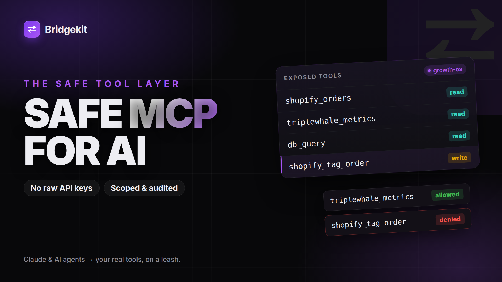

# Bridgekit

A scoped **MCP server** that exposes a company's tools (Shopify, Triple Whale,
Postgres) to their AI stack with per-client permission boundaries and an
append-only audit log.

## Demo

[](assets/demo.mp4)

▶ [Watch the demo](assets/demo.mp4) · Live: https://bridgekit.agentpostmortem.com


## What it exposes

| Tool | Type | Description |
|------|------|-------------|
| `shopify_orders` | read | recent orders |
| `triplewhale_metrics` | read | blended ROAS, CAC, revenue, spend |
| `db_query` | read | rows from an allowlisted Postgres table |
| `shopify_tag_order` | **write** | tag an order, needs write scope |

Read tools return clearly-labelled sample data when upstream credentials are not
configured, so the server is demoable without a live store.

## Transport

MCP over **Streamable HTTP**: clients POST JSON-RPC 2.0 to `/mcp`. Implements
`initialize`, `tools/list`, `tools/call`, and `ping`. `tools/list` only advertises
the tools the calling client is scoped for. Non-object JSON values receive a
JSON-RPC `-32600` Invalid Request response before dispatch.

## Auth & scopes

Clients are configured in the `BRIDGEKIT_CLIENTS` secret (JSON):

```json
{
  "bk_live_demo123": {
    "name": "growth-os",
    "tools": ["shopify_orders", "triplewhale_metrics", "db_query"],
    "allowWrite": false
  }
}
```

Callers send the key as `Authorization: Bearer <key>` or `x-bridgekit-key`.

## Run

```bash
npm install
cp .dev.vars.example .dev.vars   # fill secrets for local dev
npm run dev                      # wrangler dev
npm run deploy                   # ship to Cloudflare Workers (workers.dev URL)
```

Apply `supabase/schema.sql` once in the Supabase SQL editor for the audit log.

## Try it

```bash
# list tools the demo client can see
curl -s "$URL/mcp" -H "x-bridgekit-key: bk_live_demo123" \
  -H "content-type: application/json" \
  -d '{"jsonrpc":"2.0","id":1,"method":"tools/list"}'

# call a read tool
curl -s "$URL/mcp" -H "x-bridgekit-key: bk_live_demo123" \
  -H "content-type: application/json" \
  -d '{"jsonrpc":"2.0","id":2,"method":"tools/call",
       "params":{"name":"triplewhale_metrics","arguments":{}}}'

# a write tool with a read-only key is denied (and logged)
curl -s "$URL/mcp" -H "x-bridgekit-key: bk_live_demo123" \
  -H "content-type: application/json" \
  -d '{"jsonrpc":"2.0","id":3,"method":"tools/call",
       "params":{"name":"shopify_tag_order","arguments":{"orderId":1001,"tags":"vip"}}}'
```
